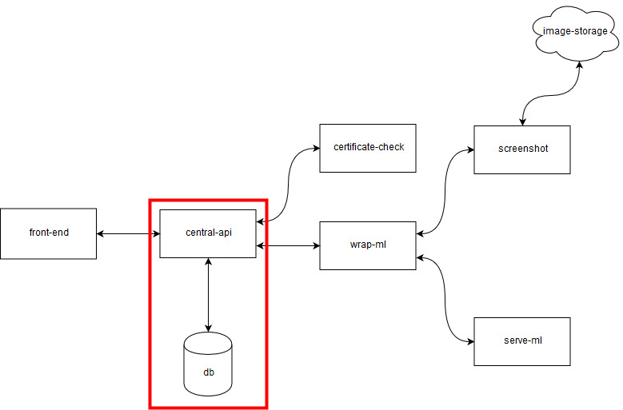

# Central API

This is the code for the central-api that combines the information off different services and saves it into the database. 



Create a .env file in the root that looks like this:

```
API_KEY=KEY
JWT_SECRET=SECRET
DB_PASSWORD=PASSWORD
DB_USER=USER
DB_NAME=NAME
DB_HOST=HOST

SCREENSHOT_URL=URL
SERVE_URL=URL
```

The database is expected to be MySQL, the schema can be made with db.sql

## Doing a request

First authenticate your request with a valid access token. Do the following POST request:

```
{ "username": "username", "password": "password" }
```

The `api-key` header should be set with a valid key.

You should recieve the following reply:

```
{
    "success": true,
    "username": "username",
    "token": "validToken"
}
```

Now you can do a webshop check in with the following request:

```
{ "url": "http://whatever" }
```

The `api-key` and `x-access-token` should be set with valid values.


You will get a response like this:

```
{
    "success": true,
    "new": true,
    "message": "http://whatever was added to the ledger",
    "score": {
        "fake": 0.98,
        "normal": 0.02,
        "good": 0
    },
    "screenshot": "https://linktoimage.jpg"
}
```